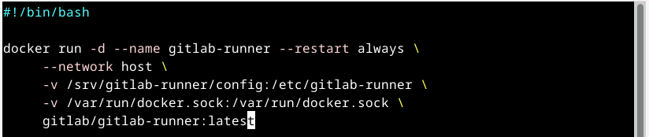
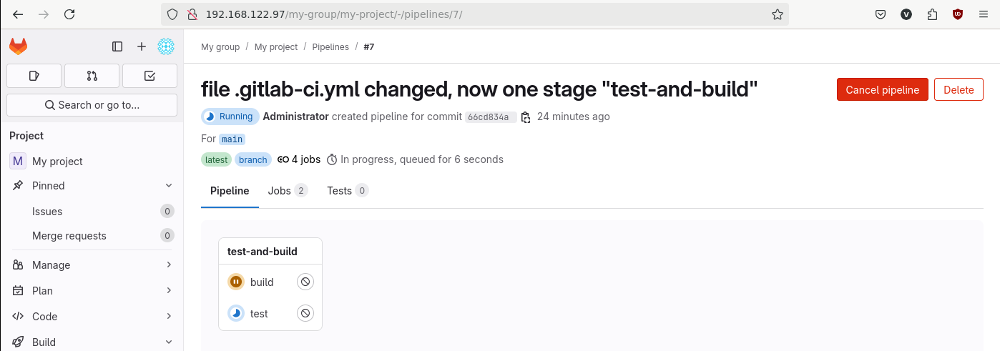
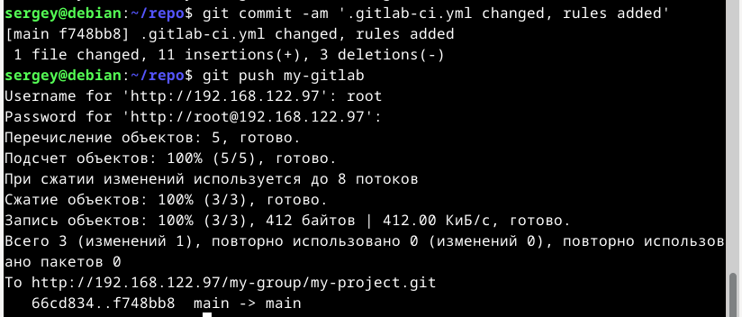

# Домашнее задание к занятию «GitLab». Потапчук Сергей.

### Инструкция по выполнению домашнего задания

   1. Сделайте `fork` [репозитория c шаблоном решения](https://github.com/netology-code/sys-pattern-homework) к себе в GitHub и переименуйте его по названию или номеру занятия, например, https://github.com/имя-вашего-репозитория/gitlab-hw или https://github.com/имя-вашего-репозитория/8-03-hw.
   2. Выполните клонирование этого репозитория к себе на ПК с помощью команды `git clone`.
   3. Выполните домашнее задание и заполните у себя локально этот файл README.md:
      - впишите сверху название занятия, ваши фамилию и имя;
      - в каждом задании добавьте решение в требуемом виде — текст, код, скриншоты, ссылка.
      - для корректного добавления скриншотов используйте [инструкцию «Как вставить скриншот в шаблон с решением»](https://github.com/netology-code/sys-pattern-homework/blob/main/screen-instruction.md);
      - при оформлении используйте возможности языка разметки md. Коротко об этом можно посмотреть в [инструкции  по MarkDown](https://github.com/netology-code/sys-pattern-homework/blob/main/md-instruction.md).
   4. После завершения работы над домашним заданием сделайте коммит `git commit -m "comment"` и отправьте его на GitHub `git push origin`.
   5. Для проверки домашнего задания в личном кабинете прикрепите и отправьте ссылку на решение в виде md-файла в вашем GitHub.
   6. Любые вопросы по выполнению заданий задавайте в чате учебной группы или в разделе «Вопросы по заданию» в личном кабинете.
   
Желаем успехов в выполнении домашнего задания!

---

### Задание 1

**Что нужно сделать:**

1. Разверните GitLab локально, используя Vagrantfile и инструкцию, описанные в [этом репозитории](https://github.com/netology-code/sdvps-materials/tree/main/gitlab).   
2. Создайте новый проект и пустой репозиторий в нём.
3. Зарегистрируйте gitlab-runner для этого проекта и запустите его в режиме Docker. Раннер можно регистрировать и запускать на той же виртуальной машине, на которой запущен GitLab.

В качестве ответа в репозиторий шаблона с решением добавьте скриншоты с настройками раннера в проекте.

### Решение

1. Создал новую ВМ с помощью [скрипта](scripts-for-creating-VMs/gitlab-server.sh)


и установил ОС подключившись через virt-manager. Определил IP ВМ.


2. Установил GitLab в соответствии с инструкцией на оффициальном сайте.


3. Изменил конфигурацию, а именно, указал IP адрес ВМ GitLab, и отключил использование Let's Encrypt


4. Реконфигурировал GitLab


5. Проверил доступность


6. Авторизовался


7. Создал новую группу


8. Создал новый проект


9. Создал отдельную машину для раннеров с помощью [скрипта](scripts-for-creating-VMs/gitlab-runners.sh)


и установил ОС подключившись через virt-manager. Определил IP ВМ.


11. Установил Docker по инструкции с оффициального сайта


12. Команда регистрации раннера большая, поэтому поместил ее в [скрипт](scripts-for-creating-and-run-runners/registration.sh)


13. Зарегистрировал раннер


14. Изменил конфигурацию раннера


15. Сделал [скрипт](scripts-for-creating-and-run-runners/registration.sh) для запуска раннера




16. Запустил раннер и проверил, что он запустился.


---

### Задание 2

**Что нужно сделать:**

1. Запушьте [репозиторий](https://github.com/netology-code/sdvps-materials/tree/main/gitlab) на GitLab, изменив origin. Это изучалось на занятии по Git.
2. Создайте .gitlab-ci.yml, описав в нём все необходимые, на ваш взгляд, этапы.

В качестве ответа в шаблон с решением добавьте: 
   
 * файл gitlab-ci.yml для своего проекта или вставьте код в соответствующее поле в шаблоне; 
 * скриншоты с успешно собранными сборками.
 
### Решение

1. Клонировал репозиторий с GitHub на локальную машину, добавил ещё один удалённый репозиторий в GitLab, а затем запушил локальный репозиторий в добавленый репозиторий (GitLab).


2. Создал файл [.gitlab-ci.yml](pipline-configurations/.gitlab-ci.yml.v1) с двумя этапами (тестирование и сборка)


3. Запушил в репозиторий


4. Проверил результат


---
## Дополнительные задания* (со звёздочкой)

Их выполнение необязательное и не влияет на получение зачёта по домашнему заданию. Можете их решить, если хотите лучше разобраться в материале.

---

### Задание 3*

Измените CI так, чтобы:

 - этап сборки запускался сразу, не дожидаясь результатов тестов;
 - тесты запускались только при изменении файлов с расширением *.go.

В качестве ответа добавьте в шаблон с решением файл gitlab-ci.yml своего проекта или вставьте код в соответсвующее поле в шаблоне.

### Решение

* Задачи, находящиеся в одной стадии(stages) выполняться параллельно по умолчанию, поэтому надо просто поместить оба этапа в одну стадию, и иметь более одного раннера, иначе, если раннер будет один, задачи все равно будут выполняться последовательно.

1. Изменил конфигурацию [пайплайна](pipline-configurations/.gitlab-ci.yml.v2) (поместил обе задачи в один этап)


2. Убедился, что с одним раннером задачи всё равно выполняются последовательно




3. Добавил ещё один раннер


4. Теперь задачи выполняются параллельно


- build на первом раннере


- test на втором


* для того, чтобы задача запускалась только при изменении файлов с расширением *.go надо использовать в задаче конструкцию:

```
  rules:
    - changes:
        - "**/*.go"
```
 
1. Снова изменил конфигурацию [пайплайна](pipline-configurations/.gitlab-ci.yml.v3)




2. Убедился, что ничего не происходит


3. Добавил в файл main.go коментарий и запушил в репозиторий


4. Проверил


---

# Дополнительно

1. Установил SonarQube

* [Скрипт ВМ](scripts-for-creating-VMs/sonarqube.sh)
* установил ОС подключившись через virt-manager
* Установил docker по инструкции
* [yaml файл](sonarqube/docker-compose.yaml) docker-ccompose для SonarQube

Пришлось повозиться, требует очень много ресурсов

* принудительно установил vm.max_map_count на ВМ

```
sudo sysctl -w vm.max_map_count=262144
echo "vm.max_map_count=262144" | sudo tee -a /etc/sysctl.conf
sudo sysctl -p
```

* Перезапустил Docker демон

```
sudo systemctl restart docker
```

* Полностью пересоздал контейнеры

```
docker compose down -v
docker compose up -d
```

* Проверил, что параметр применился внутри контейнера

```
docker exec sonarqube-new-sonarqube-1 cat /proc/sys/vm/max_map_count
```

должно вернутся 262144

Посмотреть логи можно

```
docker logs -f sonarqube-new-sonarqube-1
```

2. Залогинился в SonarQube, создал новый проект.

3. Создал новый [pipeline](pipline-configurations/.gitlab-ci.yml.v4) и запушил его в GitLab

* Пришлось изменить контейнер, т.к. образ sonarsource/sonar-scanner-cli собран для процессоров с поддержкой x86-64-v2, но сервер сервер работает на более старом CPU, который не поддерживает эту версию набора инструкций.

4. Получил результат


